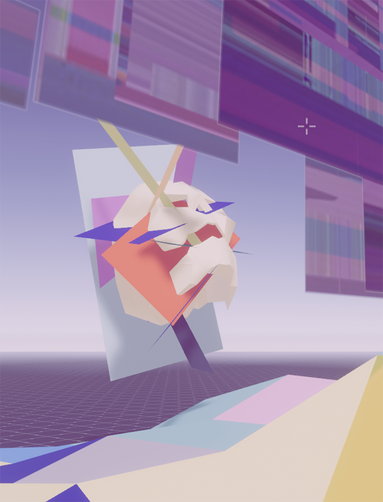

# Leveler
WIP submission for the Decentraland GameJam 2019.09# Leveler
submission for the [Decentraland GameJam 2019.09](https://gamejam.decentraland.org/)

## Game concept

Leveler is a game within the game (within another game);   a game within the Metaverse of Decentraland.

**The purpose of the game is to let the players discover what's beautiful and fascinating in the Metaverse, guiding them through a journey of discovery and philosophical reflection**.

Because of this, Leveler is (thought to be) **distributed on many parcels all over Decentraland**, not only contained in a given corner of the world, but allowing the user to enter and continue the game in different corners of the MetaVerse. 
One level of this game could become the worldwide treasure hunt: **players will have to wander around the world to find the treasures hidden in each level**, and this will be one of the ways through which they'll discover the beauties of Decentraland

Along the journey players will pick up **items that will allow them to see the world with "different eyes"**, continuosly asking them to see beyond what is purely visible, using these tools and their imagination,
to change their perspective on what DCL is and what it could become, **discovering at each level the potential of the Metaverse**, both in terms of artistic expressiveness and for the ways in which it can transform reality

***HINT***
***multiple lens can be used at once to "see" the world differently***

These items are wearable colored glasses that filter your view of the world, revealing, when the player wears them, something that was previously invisible. These filters can be combined in multiple ways to reveal different points of view

Leveler can be therefore the portal between reality and the Metaverse

The authors hope that this, possibly ever expanding game, will reflect the sensation that the real world and the digital world are coming together to create something greater, stranger and stronger than either alone

### Level concepts + screenshots
each level has a game concept

- In level 1 you will find evidence of a digital society where something has gone awry...

- Level 2 will show some ways in which technological progress has harmed us as a species

- Level 3 is a warning, a wake up call to the people.  Here the player starts to encounter some difficulty which represents the process undertaken by society.

- Level 4 represents the inital struggle of humans overcoming their previous conventions and adapting in order to survive.

- In level 5 the product of mindful technology becomes visible via means of abstract shapes with new materials.

- Level 6 is where the game really kicks off, make your way to the centre to see a 4D cube...

- Level 7 is chaos unleashed through neuron style sculptures but some hidden geometry reveals the calm that is to come.

- Level 8, if you make it, is the birthplace of a new world.

## Demo
to simplify the experience of testing all levels while not being deployed to different areas of the Decentraland you can visit a demo here

[Leveler demo](http://bit.ly/2n8GdUH)  (off-world)

- note this is a link that allows to open the url with the ENABLE_WEB3 Flag in the url, needed to enable Web3 functionality and setting information like the inventory for the user.

- we found out a possible bug with ZEIT: deploying twice to the same project creates some problems.
lesson: always deploy to a new zeit?

## Team
by their DCL discord channel nicknames

- @KJWalker: 3d artist
- @lastraum: dev 
- @difool: 3d artist
- @nemo (aka @lyricalpolymath): dev 

## Game innovations  / cool things 
- **Cross-scene inventory**: users gather items in one scene / LAND plot, and can bring them around and use them in other (compatible) scenes elsewhere in Decentraland

- can be used to **incentivize to discover different corners of the Decentraland**: by putting levels around the world

- can be used to **incentivize to visit specific districs and parcels**: district owners and parcels owners could participate even just dropping an item to be found in their scenes and implementing the inventory

- there's a storyline that can shift and grow with Decentraland

- utilized: utils libary, sytems, animations, sounds, custom GLB files, builder custom asset pack exports (for positioning), mutli "scene" loading based on server information, server storage for user data, UI implementation, moving an avatar, button events, pickable items for your avatar to hold in an inventory system

## Screenshots

